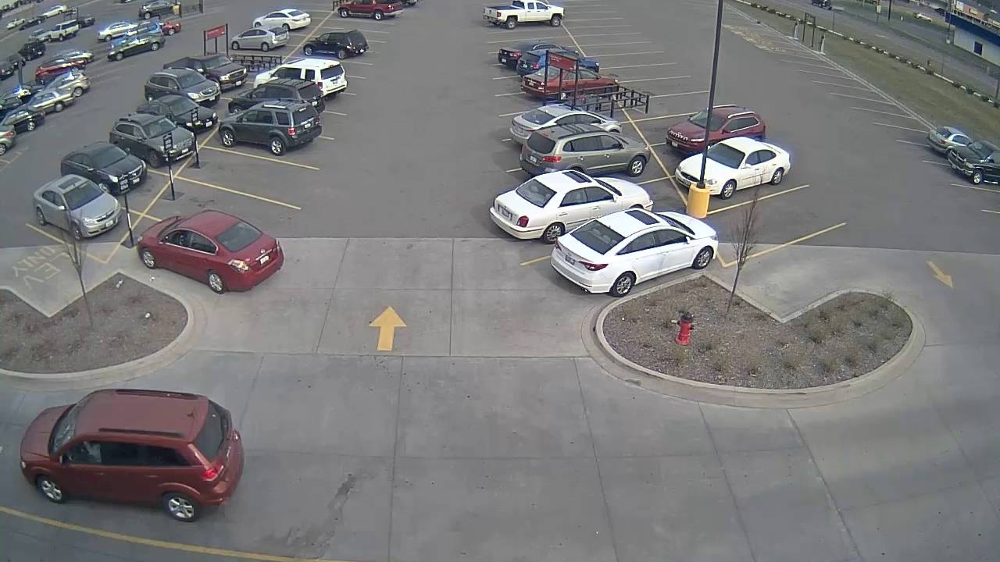
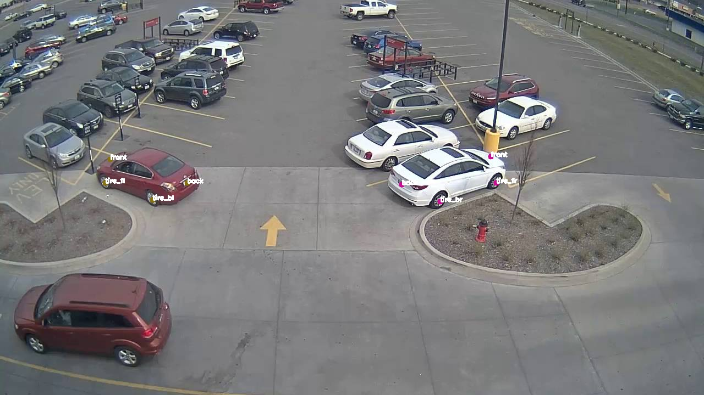
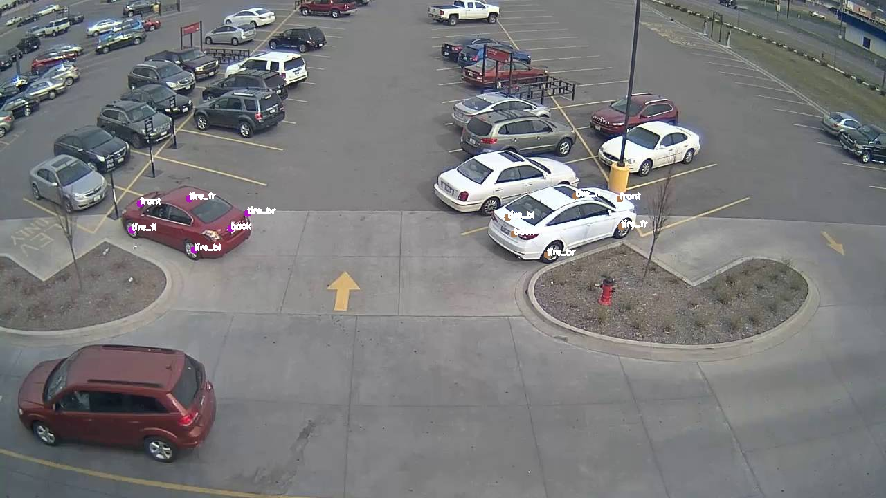
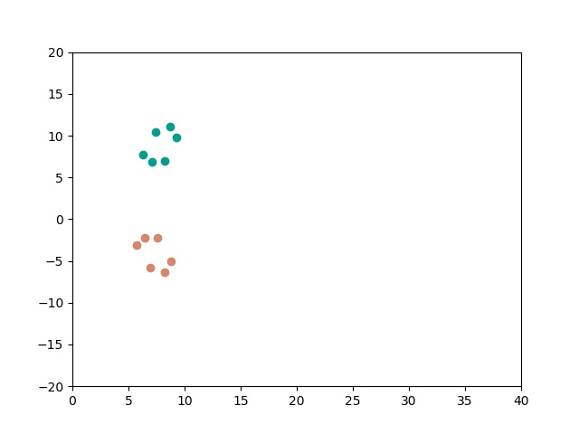
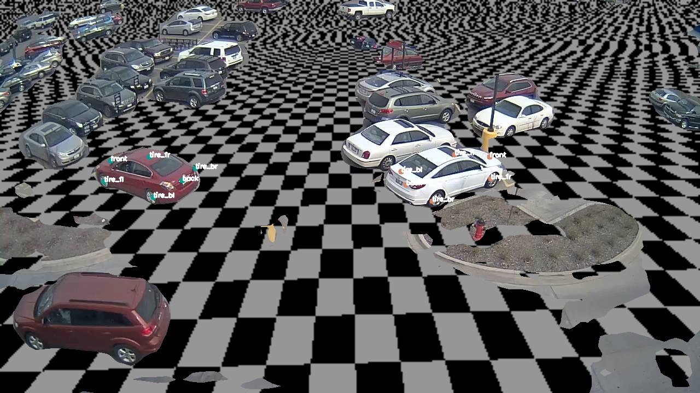

# Ground plane finder

Optimizer to find ground plane using cars as a standard candle.

### Setup
1. Install dependencies:
    * numpy
    * scipy
2. Run.


## Usage:

```bash
python main.py
```

## Results:







## Coordinate System
* World coordinates

* Camera coordinates


